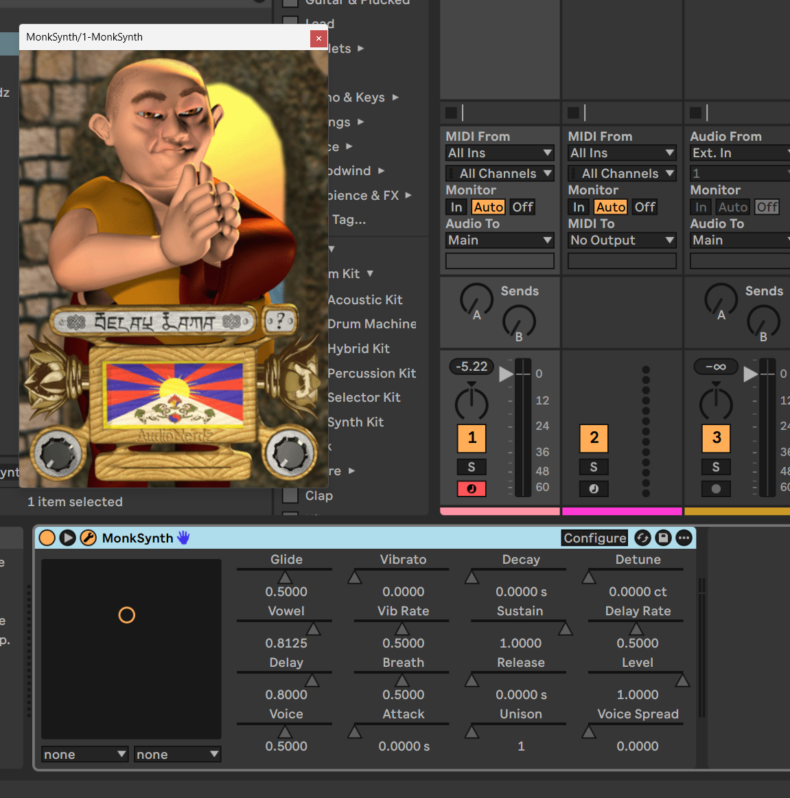

# MonkSynth

[](https://github.com/JonET/monksynth/actions/workflows/build.yml)
[](https://github.com/JonET/monksynth/releases)
[](LICENSE)

A monophonic vocal synthesizer that sounds like a monk chanting. Built using formant-wave-function (FOF) synthesis, inspired by the classic [Delay Lama](http://www.audionerdz.nl/) VST plugin by AudioNerdz (2002).

**[Download the latest release](https://github.com/JonET/monksynth/releases)** for Windows, macOS, and Linux.



*MonkSynth v0.0.1-beta.1 in Ableton Live 12, with the classic theme imported from the original Delay Lama DLL*

[](https://www.youtube.com/watch?v=OPYHfdQsWG8)

*The sound in action: [Beach Boys - Delay Lama Only Knows](https://www.youtube.com/watch?v=OPYHfdQsWG8) by Kasper Gutgesell (click to watch on YouTube)*

## Features

- FOF synthesis engine producing realistic vocal formants
- XY pad for real-time pitch and vowel control
- Built-in stereo delay effect
- MIDI support: note on/off, pitch wheel, CC1 (vibrato), CC5 (glide), CC7 (volume), CC12 (delay), CC13 (voice)
- Automatable **Pitch Bend** parameter (±12 semitones). The hardware pitch wheel is routable to either Vowel (Classic / Delay Lama compat, the default) or Pitch via right-click → Pitch Bend
- ADSR envelope with configurable attack, decay, sustain, release
- Unison mode with up to 10 detuned voices and voice spread
- Theme system with right-click context menu for custom themes
- Import classic theme from the original Delay Lama DLL
- 5 factory presets
- VST3 plugin format (Windows, macOS, Linux) and Audio Unit (macOS)

## Building

### Prerequisites

- CMake 3.20+
- C/C++ compiler (MSVC, GCC, or Clang)

### Build

```bash
cd cpp
cmake -B build
cmake --build build --config Release --target MonkSynth
```

The VST3 SDK is fetched automatically by CMake. The built plugin is placed in your system VST3 directory.

### macOS Audio Unit

To also build the AU plugin, install the [AudioUnit SDK](https://github.com/apple/AudioUnitSDK) and configure with:

```bash
cmake -B build -G Xcode -DSMTG_AUDIOUNIT_SDK_PATH=/path/to/AudioUnitSDK
cmake --build build --config Release --target MonkSynth-au
```

### DSP unit tests

The pure-C DSP layer (`dsp/`) has a small unit test suite exercising ADSR envelope boundaries, the note stack, unison detune math, pitch-bend propagation, and delay-line feedback stability. Tests are opt-in so they don't affect normal plugin builds:

```bash
cd cpp
cmake -B build-tests -DMONKSYNTH_BUILD_TESTS=ON
cmake --build build-tests --config Release
ctest --test-dir build-tests --output-on-failure
```

CI runs the test suite on the Linux job before packaging each release, so any DSP regression blocks the build.

## Installation

- **macOS:** Run the `.pkg` installer. It installs both the VST3 and AU plugins
- **Windows:** Run the `.exe` installer — installs the VST3 plugin
- **Linux:** Extract and copy `MonkSynth.vst3` to `~/.vst3/`

### Linux compatibility

The Linux build is verified on each release to load cleanly under strict loader semantics (Bitwig-style `dlopen(RTLD_NOW)`) on these distro families:

- Ubuntu 22.04 (the build baseline), the current LTS, and the newest release (and derivatives: Linux Mint, Pop!_OS, Elementary, KDE neon)
- Debian stable and oldstable (and derivatives: KX Studio, AV Linux, MX Linux)
- Fedora (latest)
- Arch Linux (and derivatives: Manjaro, EndeavourOS, CachyOS)

If your distro isn't listed it most likely still works. These are smoke-tested in CI to catch the missing-shared-library class of bug, not an exhaustive support claim. The plugin is built on Ubuntu 22.04 (glibc 2.35), so any distro with glibc ≥ 2.35 should be compatible. Reports from other distros are welcome via [GitHub Issues](https://github.com/JonET/monksynth/issues).

## Presets

The Windows and macOS installers put the five factory presets where your DAW expects them. If you use the zip downloads (the only option on Linux), copy the `presets/*.vstpreset` files from the zip into the VST3 preset folder for your platform:

- Linux: `~/.vst3/presets/MonkSynth/MonkSynth/`
- macOS: `~/Library/Audio/Presets/MonkSynth/MonkSynth/`
- Windows: `%APPDATA%\VST3 Presets\MonkSynth\MonkSynth\` (the folder the installer uses)

Most hosts pick them up on the next plug-in rescan.

## Themes

On first launch, MonkSynth shows a setup screen where you can import the classic look from the original Delay Lama DLL (available as freeware from [audionerdz.nl](http://www.audionerdz.nl/download.htm)). That's the recommended path. The setup screen also offers the built-in "Smiley Face..." theme by gav as a one-click alternative if you'd rather not hunt down the DLL.

You can also drag `Delay Lama.dll` straight onto the setup screen.

**Logic Pro and GarageBand users:** macOS won't let the AU read files you pick or drop from Downloads, Desktop or Documents ("Operation not permitted"). Click "Open themes folder" on the setup screen and copy `Delay Lama.dll` into that folder; it's imported automatically as soon as it lands there.

Right-click the plugin GUI to switch between installed themes, load a theme from anywhere on disk, or open the themes folder. Themes live in a per-user folder:

- macOS: `~/Library/Application Support/MonkSynth/themes/`
- Windows: `%APPDATA%\MonkSynth\themes\`
- Linux: `~/.config/MonkSynth/themes/`

Community themes are collected in [`themes/`](themes/) in this repo. Themes named in `MONKSYNTH_BUNDLED_THEMES` in [`cpp/CMakeLists.txt`](cpp/CMakeLists.txt) are packaged inside the plugin bundle and show up in the menu automatically; to use any other, copy its folder into the themes folder above and pick it from the right-click menu.

A theme folder contains a `theme.json` manifest and any combination of these PNG files (missing ones fall back to 1x1 placeholders):

- `background.png` — main background (360x510)
- `monk-strip.png` — animation sprite sheet (5x6 grid, 314x311 frames)
- `knob-left.png` / `knob-right.png` — rotary knob filmstrips (50x3000, 60 frames)
- `fader-down-large.png` / `fader-down-sm.png` / `fader-right-sm.png` — fader handles
- `info.png` — info overlay (253x275)

`theme.json` holds the theme's credits, shown via right-click → "About Theme...". All fields are optional except `name`; values are plain single-line strings (no `\"` escapes):

```json
{
  "name": "Smiley Face...",
  "author": "gav",
  "version": "1.0",
  "description": "One or two sentences about the theme and what it references.",
  "url": "https://example.com/link-to-the-inspiration"
}
```

**Looking for fresh default themes to ship with the plugin.** If you design a theme you're proud of, open a PR adding it under `themes/<your-theme>/` — I'd love to include contributed themes in the next release. The right-click menu has an "Open Themes Folder" item that reveals where themes live on disk.

## Translations

The plugin UI (setup screen, info overlay, right-click menu, and DLL-importer error messages) is available in English, Japanese, and Korean. The language auto-detects from your OS locale; you can override it via right-click → Language.

**Japanese and Korean translations were generated by a large language model as a starting point.** Native-speaker contributions are very welcome — please open a PR editing `cpp/src/strings_ja.h` or `cpp/src/strings_ko.h`. Every string is indexed by the `StringId` enum in `cpp/src/i18n.h`; keep entries in the same order and leave any you're unsure about as empty strings to fall back to English.

Parameter names (shown in your DAW's automation lanes) stay English on purpose — tutorials, presets, and community discussion all assume the English names.

## Code Signing Policy

Free code signing provided by [SignPath.io](https://about.signpath.io/), certificate by [SignPath Foundation](https://signpath.org/).

The Windows VST3 plugin and installer are signed as part of the release build in GitHub Actions. Signing requests are submitted to SignPath only for tagged releases built from this repository, and each request is manually approved in the SignPath UI before the certificate is applied.

| Privileged role | Signer |
|-----------------|--------|
| Author          | [Jonathan Taylor](https://github.com/JonET) |
| Reviewer        | [Jonathan Taylor](https://github.com/JonET) |
| Approver        | [Jonathan Taylor](https://github.com/JonET) |

### Privacy Policy

This program will not transfer any information to other networked systems unless specifically requested by the user or the person installing or operating it.

## Acknowledgments

- [Delay Lama](http://www.audionerdz.nl/) by AudioNerdz (2002) — the beloved freeware VST plugin that inspired this project
- Xavier Rodet (IRCAM) — formant-wave-function (FOF) synthesis technique
- [stb_image_write](https://github.com/nothings/stb) by Sean Barrett — single-header image writing (MIT / public domain)
- [VST3 SDK](https://github.com/steinbergmedia/vst3sdk) by Steinberg — plugin framework (MIT)
- [SignPath Foundation](https://signpath.org/) — free Windows code signing for open source projects

## License

[MIT](LICENSE)
